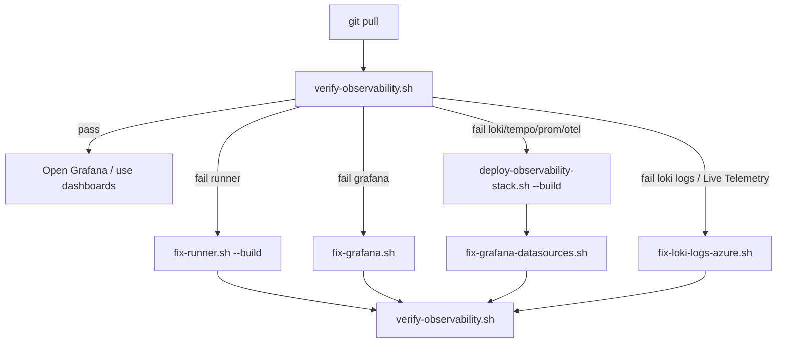

# Azure Cloud Shell — Iterative Commands

Commands you **re-run** after the one-time setup in [AZURE_CLOUDSHELL_SETUP.md](./AZURE_CLOUDSHELL_SETUP.md).

Use **one Cloud Shell tab** for deploy/fix scripts. Open a **second tab** only for read-only status checks.

---

## Sandbox constants

| Setting | Value |
|---|---|
| Subscription | `216d62c8-0f0c-4e5c-9cda-cc553e7ab186` |
| Resource group | `az03-al-titan-sandbox-rg` |
| Repo dir | `~/observability` |

---

## Every session (run first)

Copy this block when you open a new Cloud Shell session:

```bash
az account set --subscription "216d62c8-0f0c-4e5c-9cda-cc553e7ab186"
cd ~/observability   # spelling: observability (with v)
git pull
chmod +x scripts/*.sh

# quick sanity check before deploy
ls -la .env.azure || echo "Run bootstrap first — see Missing .env.azure section"
```

Optional — load names used below:

```bash
export RG="az03-al-titan-sandbox-rg"
export RUNNER="ai-telemetry-runner-dev"
export GRAFANA="grafana-telemetry-dev"
export LOKI="loki-telemetry-dev"
export TEMPO="tempo-telemetry-dev"
export PROM="prometheus-scraper-dev"
export OTEL="otel-collector-dev"
```

---

## Quick verify (read-only, safe anytime)

### All components — one script

```bash
./scripts/verify-observability.sh
```

**Success:** `All checks passed` + Grafana URL.

### Manual curls

```bash
GRAFANA_FQDN=$(az containerapp show -n "$GRAFANA" -g "$RG" --query "properties.configuration.ingress.fqdn" -o tsv)
RUNNER_FQDN=$(az containerapp show -n "$RUNNER" -g "$RG" --query "properties.configuration.ingress.fqdn" -o tsv)

echo "Grafana: https://${GRAFANA_FQDN}  (admin / admin)"
curl -sf "https://${GRAFANA_FQDN}/api/health"
curl -sf "https://${RUNNER_FQDN}/metrics" | grep -m3 ai_gateway
```

### Status table (second tab while deploy runs)

```bash
for app in "$RUNNER" "$GRAFANA" "$LOKI" "$TEMPO" "$PROM" "$OTEL"; do
  az containerapp show -n "$app" -g "$RG" \
    --query "{app:name,status:properties.runningStatus,provisioning:properties.provisioningState}" -o json 2>/dev/null \
    || echo "{\"app\":\"$app\",\"status\":\"missing\"}"
done
```

---

## Re-deploy scenarios

| When | Command |
|---|---|
| After `git pull` with script/infra changes | `./scripts/cloudshell-setup-complete.sh` |
| Same as above (alias) | `./scripts/cloudshell-deploy.sh` |
| Backend only (Loki/Tempo/Prom/Collector) | `./scripts/deploy-observability-stack.sh --build` |
| **Loki logs empty / Live Telemetry Events** | `./scripts/fix-loki-logs-azure.sh` |
| Grafana only (refresh datasources) | `./scripts/fix-grafana-datasources.sh` |
| Grafana image + dashboards rebuild | `./scripts/rebuild-grafana-azure.sh` |
| Grafana only (legacy bootstrap path) | `export FORCE_CONTAINER_DEPLOY=true && ./scripts/bootstrap-azure.sh --grafana-only` |
| Force full refresh (ignore “already healthy”) | `export FORCE_CONTAINER_DEPLOY=true && ./scripts/cloudshell-setup-complete.sh` |
| Force rebuild all ACR images | `export FORCE_IMAGE_BUILD=true && ./scripts/cloudshell-setup-complete.sh` |

### Backend + Grafana refresh (common after stack changes)

```bash
git pull
./scripts/deploy-observability-stack.sh --build
export FORCE_CONTAINER_DEPLOY=true
./scripts/bootstrap-azure.sh --grafana-only
./scripts/verify-observability.sh
```

### Re-bootstrap infra only (ACR, CAE, Event Hub — no full app redeploy)

```bash
./scripts/bootstrap-azure.sh
```

Safe to re-run — reuses existing resources.

---

## Fix commands (when verify fails)

Run **`git pull` first**, then pick one:

| Symptom | Command |
|---|---|
| **Missing `.env.azure`** | See [Missing `.env.azure`](#missing-envazure) below |
| Wrong repo folder (`obserability` typo) | `cd ~/observability` — note the **v** |
| Grafana 404 / no healthy replicas | `./scripts/fix-grafana.sh` |
| Grafana ACR 401 / ImagePullBackOff | `./scripts/fix-grafana-acr.sh --force` |
| Grafana still broken after ACR fix | `./scripts/fix-grafana-acr.sh --recreate` |
| Runner 404 / no `/metrics` (40/40 polls) | `git pull` then `./scripts/fix-runner.sh --recreate --build` — see diagnostics at end |
| **No Loki data / Live Telemetry Events empty** | `git pull` then `./scripts/diagnose-grafana-azure.sh` → `./scripts/fix-loki-logs-azure.sh` |
| **OTel Running, Loki diagnose still 0** | Manual checks in [Loki logs section](#manual-checks-when-diagnose-shows-0-loki-logs) |
| **Grafana Explore shows no logs** | Use LogQL below — not `{ } \|= ""` (empty query) |
| **OTel Collector “not confirmed ready”** | Often a false alarm from Cloud Shell curl — check `runningStatus` below |
| Duplicate dashboard nav buttons | `git pull` then `./scripts/rebuild-grafana-azure.sh` |
| `ContainerAppOperationInProgress` | Close other tabs → wait 2 min → re-run fix script |
| Stale probe errors | `git pull` then `./scripts/fix-grafana.sh` |

Then verify:

```bash
./scripts/verify-observability.sh
./scripts/diagnose-grafana-azure.sh   # Loki: any service_name streams + telemetry_event counts
```

---

## Loki logs & Live Telemetry Events

Dashboard panels such as **Live Telemetry Events**, **Active users**, **Routing reason**, and **Cost per request** read from **Loki** (not Prometheus). If Prometheus panels have data but Loki panels are empty, fix the log pipeline.

### One-command repair (recommended)

```bash
git pull
chmod +x scripts/fix-loki-logs-azure.sh
./scripts/fix-loki-logs-azure.sh
```

This script:

1. Rebuilds **Loki** (OTLP-ready config) + **OTel Collector** (`otlphttp/loki` exporter)
2. Rewires **runner OTLP** → collector and **forces a new runner revision**
3. Refreshes **Grafana** datasources + dashboards
4. Runs **Loki diagnostics**

Takes ~10–15 min (ACR builds). Wait **2–3 min** after it finishes for runner batches to appear in Loki.

### Diagnose first (collector Running but Loki empty)

Prometheus panels can have data while Loki is empty — that means the **log pipeline** is broken, not Grafana.

```bash
git pull
./scripts/diagnose-grafana-azure.sh
```

**What the script checks:**

| Section | Good sign |
|---|---|
| `Runner OTLP endpoint → collector` | `OTEL_EXPORTER_OTLP_ENDPOINT` = `http://otel-collector-dev.internal.<domain>:4317` |
| `OTLP log exporter` in runner logs | Line like `OTLP log exporter → http://otel-collector-dev.internal...` |
| `Collector Loki OTLP endpoint` | `LOKI_OTLP_ENDPOINT` = `https://loki-telemetry-dev.internal.<domain>/otlp` |
| `Runner OTLP logs endpoint` | `OTEL_EXPORTER_OTLP_LOGS_ENDPOINT` = `http://otel-collector-dev.internal.<domain>:4318` |
| `loki image` | `acrtelemetrydevaj.azurecr.io/loki:latest` (not stock `grafana/loki:3.2.1`) |
| Loki label names | Includes `service_name` |
| Loki queries | `any service_name streams (15m):` **> 0**, then `telemetry_event (15m):` **> 0** |

**Failure:** `any service_name streams (15m): 0` → nothing reached Loki. Run `./scripts/fix-loki-logs-azure.sh`.

**Partial failure:** streams **> 0** but `telemetry_event (15m): 0` → logs arrive but runner batches may not be emitting; check runner is Running and `ALLOW_MOCK_MODE=true`.

### Manual checks (when diagnose shows 0 Loki logs)

Use these in a **second tab** while `fix-loki-logs-azure.sh` runs, or after repair if counts are still 0.

**Runner OTLP env (must not be localhost):**

```bash
export RG="az03-al-titan-sandbox-rg"
export RUNNER="ai-telemetry-runner-dev"

az containerapp show -n "$RUNNER" -g "$RG" \
  --query "properties.template.containers[0].env[?name=='OTEL_EXPORTER_OTLP_ENDPOINT' || name=='ALLOW_MOCK_MODE' || name=='OTEL_SERVICE_NAME']" -o table
```

**Runner started OTLP log export:**

```bash
az containerapp logs show -n "$RUNNER" -g "$RG" --type console --tail 50 \
  | grep -i "OTLP log exporter"
```

Expect: `OTLP log exporter → http://otel-collector-dev.internal.<domain>:4317`

If missing:

```bash
./scripts/fix-runner.sh --build --no-git-pull
```

**Collector → Loki wiring:**

```bash
export OTEL="otel-collector-dev"
export LOKI="loki-telemetry-dev"

az containerapp show -n "$OTEL" -g "$RG" \
  --query "properties.template.containers[0].env[?name=='LOKI_OTLP_ENDPOINT' || name=='TEMPO_ENDPOINT']" -o table

az containerapp show -n "$LOKI" -g "$RG" \
  --query "properties.template.containers[0].image" -o tsv
```

Expect:

- `LOKI_OTLP_ENDPOINT` = `https://loki-telemetry-dev.internal.<domain>/otlp` (internal HTTPS ingress; collector uses `tls.insecure: true`)
- `OTEL_EXPORTER_OTLP_LOGS_ENDPOINT` = `http://otel-collector-dev.internal.<domain>:4318`
- Loki image = `acrtelemetrydevaj.azurecr.io/loki:latest`

If `LOKI_OTLP_ENDPOINT` is unset or Loki uses `grafana/loki:*`:

```bash
export FORCE_CONTAINER_DEPLOY=true
./scripts/deploy-observability-stack.sh --build --from loki
```

**Collector export errors (TLS / 404 to Loki):**

```bash
az containerapp logs show -n "$OTEL" -g "$RG" --type console --tail 50 \
  | grep -Ei 'error|failed|refused|404|401|tls|loki|otlphttp'
```

Look for `invalid OTel Collector config`, TLS handshake failures, or HTTP 404 on `/otlp/v1/logs`.

**Force runner OTLP reconnect (after collector redeploy):**

```bash
CAE_DOMAIN=$(az containerapp env show -n cae-telemetry-dev -g "$RG" \
  --query properties.defaultDomain -o tsv)
OTEL_EP="http://otel-collector-dev.internal.${CAE_DOMAIN}:4317"

az containerapp update -n "$RUNNER" -g "$RG" \
  --set-env-vars \
    "OTEL_EXPORTER_OTLP_ENDPOINT=http://otel-collector-dev.internal.${CAE_DOMAIN}:4317" \
    "OTEL_EXPORTER_OTLP_LOGS_ENDPOINT=http://otel-collector-dev.internal.${CAE_DOMAIN}:4318" \
    "OTEL_EXPORTER_OTLP_LOGS_PROTOCOL=http/protobuf" \
    "OTEL_EXPORTER_OTLP_INSECURE=true" \
  --output none
```

Wait 2–3 min, then re-run `./scripts/diagnose-grafana-azure.sh`.

### Step-by-step (same as the script)

```bash
git pull
export FORCE_CONTAINER_DEPLOY=true
./scripts/deploy-observability-stack.sh --build --from loki
./scripts/deploy-observability-stack.sh --from otlp --no-git-pull
./scripts/fix-runner.sh --no-git-pull

# force new runner revision (OTLP log exporter reconnect)
CAE_DOMAIN=$(az containerapp env show -n cae-telemetry-dev -g az03-al-titan-sandbox-rg \
  --query properties.defaultDomain -o tsv)
az containerapp update -n ai-telemetry-runner-dev -g az03-al-titan-sandbox-rg \
  --set-env-vars \
    "OTEL_EXPORTER_OTLP_ENDPOINT=http://otel-collector-dev.internal.${CAE_DOMAIN}:4317" \
    "OTEL_EXPORTER_OTLP_INSECURE=true" \
  --output none

python3 dashboards/generate_dashboards.py
./scripts/fix-grafana-datasources.sh
./scripts/diagnose-grafana-azure.sh
```

### Verify OTel Collector is Running

Cloud Shell **cannot curl** internal apps — `WARN: OTel Collector not confirmed ready` during deploy is often a **false alarm**. Check Azure status instead:

```bash
export RG="az03-al-titan-sandbox-rg"
export OTEL="otel-collector-dev"

az containerapp show -n "$OTEL" -g "$RG" \
  --query "{running:properties.runningStatus,prov:properties.provisioningState,revision:properties.latestRevisionName}" -o json
```

| Field | Good value |
|---|---|
| `running` | `Running` |
| `prov` | `Succeeded` |

If not Running:

```bash
az containerapp logs show -n "$OTEL" -g "$RG" --type console --tail 50
```

Look for `invalid OTel Collector config`, TLS errors to Loki, or missing env vars (`LOKI_OTLP_ENDPOINT`).

### Verify runner OTLP env

```bash
export RUNNER="ai-telemetry-runner-dev"

az containerapp show -n "$RUNNER" -g "$RG" \
  --query "properties.template.containers[0].env[?name=='OTEL_EXPORTER_OTLP_ENDPOINT' || name=='ALLOW_MOCK_MODE']" -o table
```

Expect `OTEL_EXPORTER_OTLP_ENDPOINT` = `http://otel-collector-dev.internal.<cae-domain>:4317` (not `localhost`).

### Loki diagnostics (via Grafana proxy)

```bash
./scripts/diagnose-grafana-azure.sh
```

**Success:**

- `any service_name streams (15m):` **> 0**
- `telemetry_event (15m):` **> 0**

**Still 0 after repair?** See [Manual checks (when diagnose shows 0 Loki logs)](#manual-checks-when-diagnose-shows-0-loki-logs) above.

### Grafana Explore — correct LogQL

Open **Explore → Loki → Code** (not the empty builder). Do **not** use `{ } |= ""`.

```logql
{service_name=~".+"} | json | event_type="telemetry_event"
```

- Time range: **Last 15 minutes** (turn **Live** off until data appears)
- Dashboard filters: set all to **All** on Dashboard 2 when testing **Live Telemetry Events**

### Hard refresh Grafana after deploy

```bash
GRAFANA_FQDN=$(az containerapp show -n "$GRAFANA" -g "$RG" \
  --query "properties.configuration.ingress.fqdn" -o tsv)
echo "https://${GRAFANA_FQDN}/d/ai-telemetry-traffic"
```

In the browser: **Ctrl+Shift+R** (hard refresh).

### Loki / telemetry symptom table

| Symptom | Likely cause | Fix |
|---|---|---|
| Explore `{ } \|= ""` → No data | Empty query | Use LogQL block above |
| Prometheus OK, all Loki panels empty | Log pipeline not deployed | `./scripts/fix-loki-logs-azure.sh` |
| **`any service_name streams (15m): 0`** in diagnose | Nothing reached Loki (runner → collector → Loki) | `./scripts/fix-loki-logs-azure.sh` |
| **OTel Collector `Running` but Loki still 0** | Wrong `LOKI_OTLP_ENDPOINT`, stock Loki image, or runner not exporting OTLP logs | Diagnose section + manual checks above |
| `telemetry_event (15m): 0` but streams **> 0** | Runner not emitting batches | Check runner Running + `ALLOW_MOCK_MODE=true`; `./scripts/fix-runner.sh --build` |
| No `OTLP log exporter` in runner logs | Runner env/revision stale | `./scripts/fix-runner.sh --build` or force OTLP env update (manual checks) |
| Loki image is `grafana/loki:*` not ACR | Old Loki deploy without OTLP config | `./scripts/fix-loki-logs-azure.sh` |
| OTel deploy warns “not confirmed ready” | Old curl check from Cloud Shell | Check `runningStatus` — ignore if `Running` |
| Duplicate dashboard link rows | Stale Grafana image | `./scripts/rebuild-grafana-azure.sh` |

---

## Logs and diagnostics

```bash
# Replicas (0 replicas = 404 even if status is Running)
az containerapp replica list -n "$GRAFANA" -g "$RG" -o table
az containerapp replica list -n "$RUNNER" -g "$RG" -o table

# Recent logs
az containerapp logs show -n "$GRAFANA" -g "$RG" --type console --tail 40
az containerapp logs show -n "$RUNNER" -g "$RG" --type console --tail 40
az containerapp logs show -n "$OTEL" -g "$RG" --type console --tail 40

# Loki log pipeline (runner export + collector → Loki)
az containerapp logs show -n "$RUNNER" -g "$RG" --type console --tail 50 | grep -i "OTLP log"
az containerapp logs show -n "$OTEL" -g "$RG" --type console --tail 50 | grep -Ei 'error|loki|failed|404|tls'
az containerapp show -n "$OTEL" -g "$RG" \
  --query "properties.template.containers[0].env[?name=='LOKI_OTLP_ENDPOINT']" -o table

# ACR images present
az acr repository list --name acrtelemetrydevaj -o table
```

Platform logs (stdout) → **Log Analytics** in Azure Portal → Container Apps → your app → Log stream / Logs.

---

## Environment / secrets

### Check `.env.azure` exists

```bash
pwd
# must end with: .../observability  (not obserability)

ls -la .env.azure
cat .env.azure | head -15
```

### Missing `.env.azure`

Deploy scripts fail with:

```text
ERROR: Missing /home/.../observability/.env.azure — run ./scripts/bootstrap-azure.sh first
```

**Cause:** Bootstrap was not run yet, or you are in the wrong clone/folder (common typo: `~/obserability` vs `~/observability`).

**Fix — use the correct directory:**

```bash
az account set --subscription "216d62c8-0f0c-4e5c-9cda-cc553e7ab186"
cd ~/observability
pwd
```

If `cd ~/observability` fails, clone again:

```bash
git clone https://github.com/ajaykhannaus/azure-telemetry-llm.git
cd observability
git pull
chmod +x scripts/*.sh
```

**Fix — create config (first time only):**

```bash
cp azure/bootstrap-azure.sandbox.env azure/bootstrap-azure.env
./scripts/cloudshell-prepare.sh
```

**Fix — generate `.env.azure`:**

```bash
./scripts/bootstrap-azure.sh --preflight
./scripts/bootstrap-azure.sh
```

Bootstrap writes `.env.azure` (Event Hub connection string, resource group, ACR, etc.). Safe to re-run if infra already exists — it reuses resources and recreates the file.

**Confirm, then deploy:**

```bash
ls -la .env.azure
./scripts/cloudshell-deploy.sh
```

| Step | Command | Creates `.env.azure`? |
|---|---|---|
| First time (or file missing) | `./scripts/bootstrap-azure.sh` | **Yes** |
| After that | `./scripts/cloudshell-deploy.sh` | No — needs existing file |

If bootstrap ran in a **different** Cloud Shell session or folder, `.env.azure` is only in that clone — `cd` there or re-run bootstrap in `~/observability`.

### Runner health check (while waiting or after 40/40)

Use these in a **second tab** while `fix-runner.sh` polls, or after you see **1 replica** in the list.

**Set names (once per session):**

```bash
export RG="az03-al-titan-sandbox-rg"
export RUNNER="ai-telemetry-runner-dev"
```

**Replicas (need `-g` / resource group):**

```bash
az containerapp replica list -n "$RUNNER" -g "$RG" -o table
```

**Quick status:**

```bash
az containerapp show -n "$RUNNER" -g "$RG" \
  --query "{status:properties.runningStatus,provisioning:properties.provisioningState,revision:properties.latestRevisionName}" -o json
```

| Field | Good value |
|---|---|
| `status` | `Running` |
| `provisioning` | `Succeeded` |

**Test metrics (success = runner is healthy):**

```bash
RUNNER_FQDN=$(az containerapp show -n "$RUNNER" -g "$RG" \
  --query "properties.configuration.ingress.fqdn" -o tsv)

echo "Metrics: https://${RUNNER_FQDN}/metrics"
curl -sf "https://${RUNNER_FQDN}/metrics" | grep -m3 ai_gateway
```

**If still 404 with 1+ replicas — logs:**

```bash
az containerapp logs show -n "$RUNNER" -g "$RG" --type console --tail 30
az containerapp logs show -n "$RUNNER" -g "$RG" --type system --tail 20
```

Look for `Runner starting`, Event Hub errors, `Publisher misconfigured`, or **`ModuleNotFoundError: No module named 'observability'`** (rebuild runner image: `./scripts/fix-runner.sh --recreate --build`).

**Verify your clone has the fixed Dockerfile before rebuilding:**

```bash
cd ~/observability && git pull
grep 'COPY observability/' Dockerfile.runner
grep 'runner import ok' Dockerfile.runner
git log -1 --oneline
```

During ACR build you must see **`COPY observability/`** and **`runner import ok`** — if build jumps from `COPY generator/` straight to `useradd`, you are on an old Dockerfile.

**While runner polls `/metrics`:** `waiting (4/40) — HTTP 404` or `HTTP 000` is **normal for 2–5 min** while the image pulls and the replica starts.

---

### Runner stuck at 40/40 polls

After `fix-runner.sh` exhausts waits, read the **diagnostics block** at the end.

| Log / symptom | Likely cause | Fix |
|---|---|---|
| `401` / `ImagePullBackOff` / no replicas | ACR pull failed | `./scripts/fix-runner.sh --recreate --build` |
| `Publisher misconfigured` / Event Hub errors | Bad `.env.azure` secrets | Re-run `./scripts/bootstrap-azure.sh`, check `grep EVENTHUB .env.azure` |
| `/metrics HTTP 404` for many minutes | Replicas not ready (probes) | `git pull` + `--recreate --build` |
| `ContainerTerminated` exit code **1** (~400ms after start) | Runner image missing `observability/` package | `git pull` then `./scripts/fix-runner.sh --recreate --build` |
| `ContainerAppOperationInProgress` | Parallel deploy in another tab | Close tabs, wait 2 min, retry |

Verify Event Hub vars:

```bash
grep -E '^EVENTHUB_' .env.azure
# expect:
#   EVENTHUB_NAMESPACE=evhns-telemetry-devaj.servicebus.windows.net
#   EVENTHUB_NAME=ai-telemetry-events
#   EVENTHUB_CONNECTION_STRING=Endpoint=sb://...
```

If still failing at **40/40**:

```bash
git pull
./scripts/fix-runner.sh --recreate --build
```

---

### Continue full stack (after runner metrics work)

When `curl .../metrics` shows `ai_gateway` lines:

```bash
cd ~/observability
git pull

# Option A — one command
./scripts/cloudshell-setup-complete.sh

# Option B — step by step
./scripts/deploy-observability-stack.sh
export FORCE_CONTAINER_DEPLOY=true
./scripts/bootstrap-azure.sh --grafana-only --no-build
./scripts/verify-observability.sh
```

---

### View secrets

```bash
cat .env.azure
```

### Re-check bootstrap only (no full redeploy)

Ensure sandbox flags are set before re-bootstrap:

```bash
grep -E 'PROVISION_|GRAFANA_DEFER|RUNNER_ACR' azure/bootstrap-azure.env
# expect PROVISION_OBSERVABILITY=false PROVISION_ADX=false
```

```bash
./scripts/bootstrap-azure.sh --preflight
```

To regenerate `.env.azure` (reuses ACR/CAE/Event Hub; skips ADX when `PROVISION_ADX=false`):

```bash
./scripts/bootstrap-azure.sh
```

Full stack after bootstrap:

```bash
./scripts/cloudshell-setup-complete.sh
```

---

## Force flags cheat sheet

| Variable | Effect |
|---|---|
| `FORCE_CONTAINER_DEPLOY=true` | Update Container Apps even if already serving |
| `FORCE_IMAGE_BUILD=true` | Rebuild `:latest` images in ACR |
| `GRAFANA_RECREATE=true` | Delete and recreate Grafana app |
| `GRAFANA_ACR_USE_ADMIN=true` | Use ACR admin creds (default in sandbox) |

Example — nuke and rebuild Grafana image + app:

```bash
export GRAFANA_RECREATE=true
export FORCE_IMAGE_BUILD=true
export FORCE_CONTAINER_DEPLOY=true
./scripts/bootstrap-azure.sh --grafana-only
```

---

## Typical iteration loop



**First run:** ~20–35 min (ACR builds runner/tempo/collector/prometheus images).

**While `cloudshell-setup-complete.sh` runs:** Step 1 may show `apt-get` / `debconf` output — that is **ACR building the runner Docker image** in Azure (not your Cloud Shell VM). Orange `debconf: unable to initialize frontend` lines are **harmless**; wait until the build finishes.

Force rebuild all images:

```bash
export FORCE_IMAGE_BUILD=true
./scripts/cloudshell-setup-complete.sh
```

**Minimum loop after code changes:**

1. `git pull`
2. `./scripts/cloudshell-setup-complete.sh` **or** backend + grafana refresh (see above)
3. `./scripts/verify-observability.sh`
4. Open Grafana — wait 2–3 min for dashboards to populate

---

## Container app names (reference)

| App | Name |
|---|---|
| Telemetry runner | `ai-telemetry-runner-dev` |
| Grafana | `grafana-telemetry-dev` |
| Loki | `loki-telemetry-dev` |
| Tempo | `tempo-telemetry-dev` |
| Prometheus scraper | `prometheus-scraper-dev` |
| OTel Collector | `otel-collector-dev` |
| ACR | `acrtelemetrydevaj` |
| Container Apps env | `cae-telemetry-dev` |

---

## Related docs

| Doc | Use for |
|---|---|
| [AZURE_CLOUDSHELL_SETUP.md](./AZURE_CLOUDSHELL_SETUP.md) | First-time bootstrap (Parts A–F) |
| [HOW_IT_WORKS.md](./HOW_IT_WORKS.md) | Architecture and data flow |
| [DASHBOARD_METRICS.md](./DASHBOARD_METRICS.md) | Grafana panel meanings |
