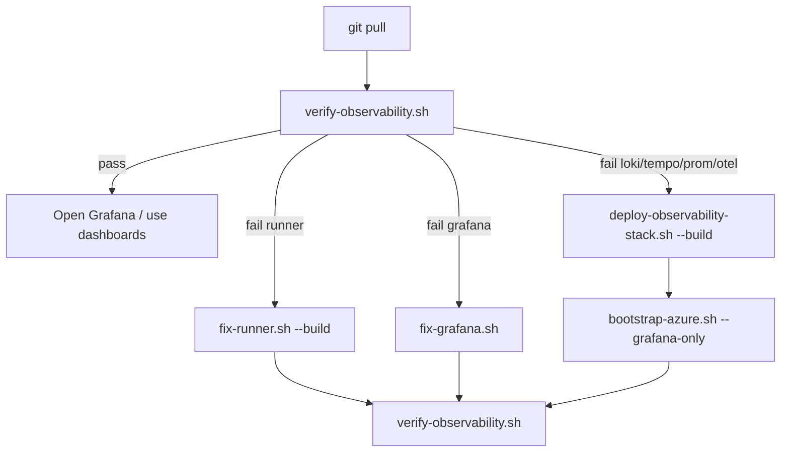

# Azure Cloud Shell — Iterative Commands

Commands you **re-run** after the one-time setup in [AZURE_CLOUDSHELL_SETUP.md](./AZURE_CLOUDSHELL_SETUP.md).

Use **one Cloud Shell tab** for deploy/fix scripts. Open a **second tab** only for read-only status checks.

---

## Sandbox constants

| Setting | Value |
|---|---|
| Subscription | `216d62c8-0f0c-4e5c-9cda-cc553e7ab186` |
| Resource group | `az03-al-titan-sandbox-rg` |
| Repo dir | `~/observability` |

---

## Every session (run first)

Copy this block when you open a new Cloud Shell session:

```bash
az account set --subscription "216d62c8-0f0c-4e5c-9cda-cc553e7ab186"
cd ~/observability
git pull
chmod +x scripts/*.sh
```

Optional — load names used below:

```bash
export RG="az03-al-titan-sandbox-rg"
export RUNNER="ai-telemetry-runner-dev"
export GRAFANA="grafana-telemetry-dev"
export LOKI="loki-telemetry-dev"
export TEMPO="tempo-telemetry-dev"
export PROM="prometheus-scraper-dev"
export OTEL="otel-collector-dev"
```

---

## Quick verify (read-only, safe anytime)

### All components — one script

```bash
./scripts/verify-observability.sh
```

**Success:** `All checks passed` + Grafana URL.

### Manual curls

```bash
GRAFANA_FQDN=$(az containerapp show -n "$GRAFANA" -g "$RG" --query "properties.configuration.ingress.fqdn" -o tsv)
RUNNER_FQDN=$(az containerapp show -n "$RUNNER" -g "$RG" --query "properties.configuration.ingress.fqdn" -o tsv)

echo "Grafana: https://${GRAFANA_FQDN}  (admin / admin)"
curl -sf "https://${GRAFANA_FQDN}/api/health"
curl -sf "https://${RUNNER_FQDN}/metrics" | grep -m3 ai_gateway
```

### Status table (second tab while deploy runs)

```bash
for app in "$RUNNER" "$GRAFANA" "$LOKI" "$TEMPO" "$PROM" "$OTEL"; do
  az containerapp show -n "$app" -g "$RG" \
    --query "{app:name,status:properties.runningStatus,provisioning:properties.provisioningState}" -o json 2>/dev/null \
    || echo "{\"app\":\"$app\",\"status\":\"missing\"}"
done
```

---

## Re-deploy scenarios

| When | Command |
|---|---|
| After `git pull` with script/infra changes | `./scripts/cloudshell-setup-complete.sh` |
| Same as above (alias) | `./scripts/cloudshell-deploy.sh` |
| Backend only (Loki/Tempo/Prom/Collector) | `./scripts/deploy-observability-stack.sh --build` |
| Grafana only (refresh datasources) | `export FORCE_CONTAINER_DEPLOY=true && ./scripts/bootstrap-azure.sh --grafana-only` |
| Force full refresh (ignore “already healthy”) | `export FORCE_CONTAINER_DEPLOY=true && ./scripts/cloudshell-setup-complete.sh` |
| Force rebuild all ACR images | `export FORCE_IMAGE_BUILD=true && ./scripts/cloudshell-setup-complete.sh` |

### Backend + Grafana refresh (common after stack changes)

```bash
git pull
./scripts/deploy-observability-stack.sh --build
export FORCE_CONTAINER_DEPLOY=true
./scripts/bootstrap-azure.sh --grafana-only
./scripts/verify-observability.sh
```

### Re-bootstrap infra only (ACR, CAE, Event Hub — no full app redeploy)

```bash
./scripts/bootstrap-azure.sh
```

Safe to re-run — reuses existing resources.

---

## Fix commands (when verify fails)

Run **`git pull` first**, then pick one:

| Symptom | Command |
|---|---|
| Grafana 404 / no healthy replicas | `./scripts/fix-grafana.sh` |
| Grafana ACR 401 / ImagePullBackOff | `./scripts/fix-grafana-acr.sh --force` |
| Grafana still broken after ACR fix | `./scripts/fix-grafana-acr.sh --recreate` |
| Runner 404 / no `/metrics` | `./scripts/fix-runner.sh --build` |
| `ContainerAppOperationInProgress` | Close other tabs → wait 2 min → re-run fix script |
| Stale probe errors | `git pull` then `./scripts/fix-grafana.sh` |

Then verify:

```bash
./scripts/verify-observability.sh
```

---

## Logs and diagnostics

```bash
# Replicas (0 replicas = 404 even if status is Running)
az containerapp replica list -n "$GRAFANA" -g "$RG" -o table
az containerapp replica list -n "$RUNNER" -g "$RG" -o table

# Recent logs
az containerapp logs show -n "$GRAFANA" -g "$RG" --type console --tail 40
az containerapp logs show -n "$RUNNER" -g "$RG" --type console --tail 40
az containerapp logs show -n "$OTEL" -g "$RG" --type console --tail 40

# ACR images present
az acr repository list --name acrtelemetrydevaj -o table
```

Platform logs (stdout) → **Log Analytics** in Azure Portal → Container Apps → your app → Log stream / Logs.

---

## Environment / secrets

```bash
cat .env.azure
```

Re-create from bootstrap (does not redeploy apps):

```bash
./scripts/bootstrap-azure.sh --preflight   # quick check
```

---

## Force flags cheat sheet

| Variable | Effect |
|---|---|
| `FORCE_CONTAINER_DEPLOY=true` | Update Container Apps even if already serving |
| `FORCE_IMAGE_BUILD=true` | Rebuild `:latest` images in ACR |
| `GRAFANA_RECREATE=true` | Delete and recreate Grafana app |
| `GRAFANA_ACR_USE_ADMIN=true` | Use ACR admin creds (default in sandbox) |

Example — nuke and rebuild Grafana image + app:

```bash
export GRAFANA_RECREATE=true
export FORCE_IMAGE_BUILD=true
export FORCE_CONTAINER_DEPLOY=true
./scripts/bootstrap-azure.sh --grafana-only
```

---

## Typical iteration loop



**Minimum loop after code changes:**

1. `git pull`
2. `./scripts/cloudshell-setup-complete.sh` **or** backend + grafana refresh (see above)
3. `./scripts/verify-observability.sh`
4. Open Grafana — wait 2–3 min for dashboards to populate

---

## Container app names (reference)

| App | Name |
|---|---|
| Telemetry runner | `ai-telemetry-runner-dev` |
| Grafana | `grafana-telemetry-dev` |
| Loki | `loki-telemetry-dev` |
| Tempo | `tempo-telemetry-dev` |
| Prometheus scraper | `prometheus-scraper-dev` |
| OTel Collector | `otel-collector-dev` |
| ACR | `acrtelemetrydevaj` |
| Container Apps env | `cae-telemetry-dev` |

---

## Related docs

| Doc | Use for |
|---|---|
| [AZURE_CLOUDSHELL_SETUP.md](./AZURE_CLOUDSHELL_SETUP.md) | First-time bootstrap (Parts A–F) |
| [HOW_IT_WORKS.md](./HOW_IT_WORKS.md) | Architecture and data flow |
| [DASHBOARD_METRICS.md](./DASHBOARD_METRICS.md) | Grafana panel meanings |
