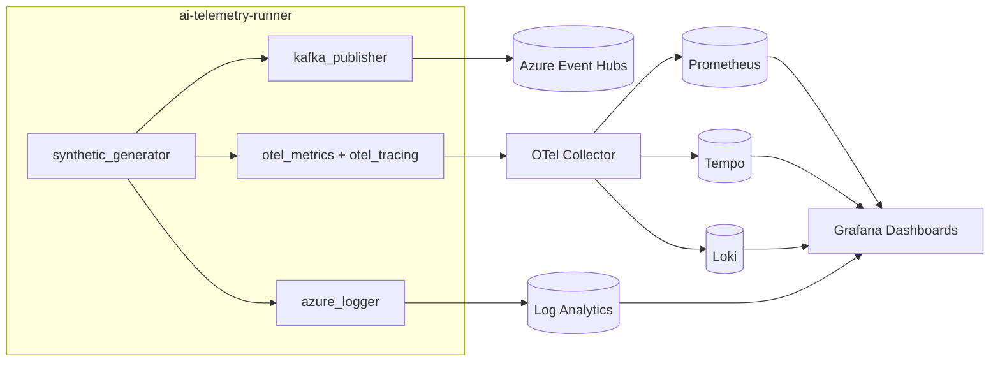
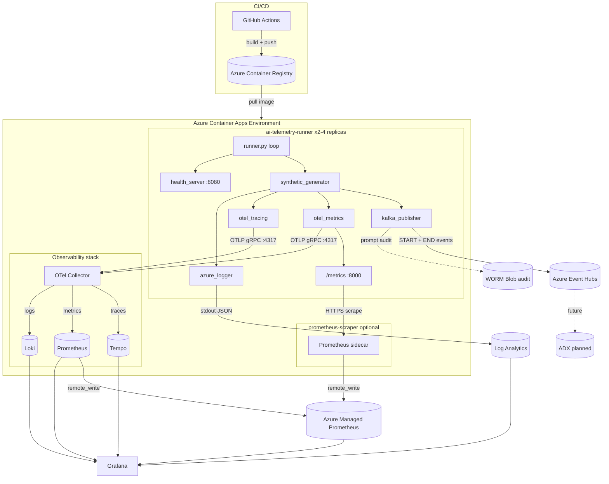
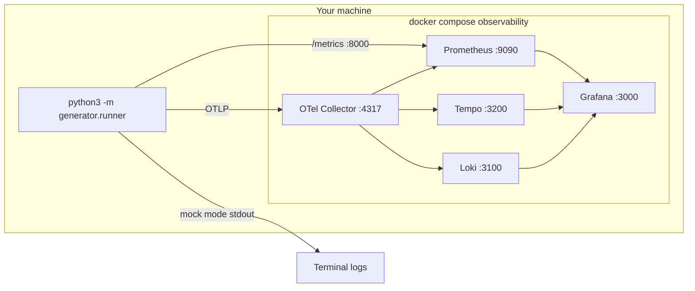
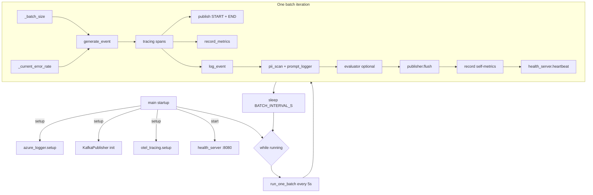
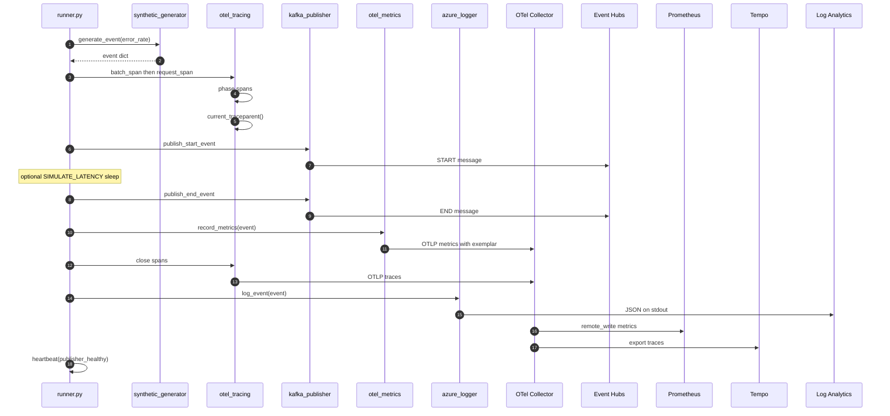
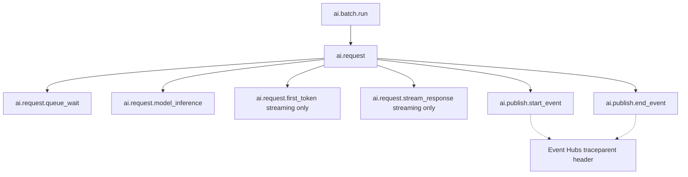
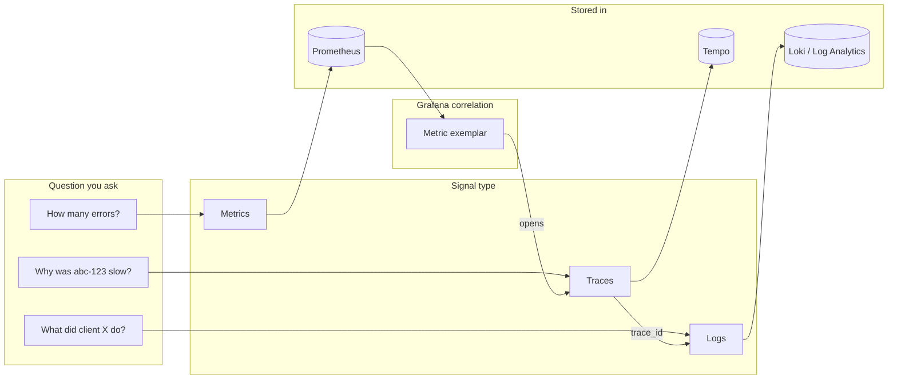
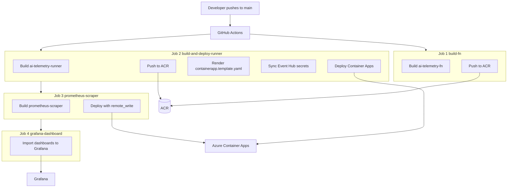
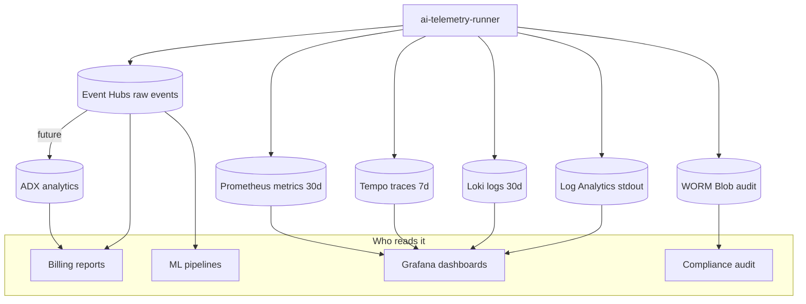

# How This Project Works

A guide for developers who already know the basics. **Brand new?** Read [BEGINNER_GUIDE.md](./BEGINNER_GUIDE.md) first — it defines Prometheus, Tempo, Loki, OTel Collector, and walks through one request step by step.

This document goes deeper: architecture diagrams, every service explained, deployment, and code reading order.

---

## What problem does this solve?

Imagine you run an internal **AI gateway** — a service that routes LLM requests (ChatGPT, Claude, etc.) for many teams inside a company. You need to answer questions like:

- How many requests are we getting per minute?
- Which models cost the most?
- Are requests slow or failing?
- Did a specific client's budget get exhausted?
- Can we trace one bad request from a dashboard chart all the way to its logs?

This project builds the **observability pipeline** for that gateway. Today it uses **synthetic (fake) traffic** that looks like real LLM requests. Later, you can swap in real gateway events without changing the downstream systems.

---

## The big picture in one sentence

> A Python **runner** generates fake LLM request events every few seconds, publishes them to **Azure Event Hubs**, and simultaneously emits **metrics**, **traces**, and **structured logs** so **Grafana** can visualize everything.

See **[Architecture diagrams](#architecture-diagrams)** below for production, local dev, request lifecycle, CI/CD, and data-store views.



---

## Architecture diagrams

Visual reference for how components connect in **production**, **local dev**, and **per-request** flow.

### 1. Production architecture (Azure)

The deployed system on Azure. The runner is the only component you write; everything else is managed infrastructure.



**Legend:**

| Arrow | Meaning |
|-------|---------|
| Solid | Active path in production today |
| Dotted | Planned or optional |
| `:8080` / `:8000` | Ports on the runner Container App |

---

### 2. Local development architecture

Run the full stack on your laptop with Docker Compose — no Azure credentials required.



**Start command:**

```bash
docker compose -f docker-compose.observability.yml up -d
OTEL_EXPORTER_OTLP_ENDPOINT=http://localhost:4317 python3 -m generator.runner
open http://localhost:3000
```

---

### 3. Runner internals — what runs inside one process



---

### 4. Single request lifecycle (sequence)

What happens to **one** synthetic LLM request from generation to storage.



---

### 5. Trace span tree (one request)

Every request produces this OpenTelemetry span hierarchy. See [semantic-conventions.md](./semantic-conventions.md) for attribute names.



---

### 6. Three signals — metrics, traces, logs

Why the project emits three different signal types instead of one.



---

### 7. CI/CD and deployment flow



First-time Azure provisioning: `infra/bootstrap.sh` creates the resource group, ACR, Container Apps Environment, and prints GitHub secrets.

---

### 8. Data stores — what each one is for



---

## Core concepts (read this first)

### 1. Event

A Python dictionary representing one LLM request. It includes things like:

- `request_id`, `client_name`, `model_name`
- `latency_ms`, `prompt_tokens`, `cost_usd`
- `status` (`success` or `error`)

Created by `generator/synthetic_generator.py` → `generate_event()`.

### 2. Batch

The runner does not process one event at a time forever in isolation. Every **5 seconds** (configurable), it generates a **batch** of ~8 events, processes them, and repeats. One batch = one loop iteration in `run_one_batch()`.

### 3. START / END events

Each logical request becomes **two Kafka messages**:

| Message | When | Purpose |
|---------|------|---------|
| `usage_event_type: "start"` | Before the "LLM call" | Signals request began |
| `usage_event_type: "end"` | After the "LLM call" | Includes latency, tokens, cost, status |

This mirrors how a real gateway would emit lifecycle events.

### 4. Three signals (metrics, traces, logs)

Observability has three complementary views:

| Signal | What it tells you | Where it goes |
|--------|-------------------|---------------|
| **Metrics** | Aggregates: request count, latency histogram, cost totals | Prometheus (via OTel) |
| **Traces** | One request's journey as a span tree | Tempo (via OTel) |
| **Logs** | Structured JSON lines per event | stdout → Azure Log Analytics |

Grafana ties them together: click a metric spike → jump to the trace → jump to related logs.

### 5. Mock mode vs production mode

If Azure Event Hubs credentials are missing, the publisher runs in **mock mode**: events are printed to stdout instead of sent to Kafka.

- **Local dev:** set `ENVIRONMENT=dev` and `ALLOW_MOCK_MODE=true` in `.env`
- **Production:** missing credentials cause startup to **fail fast** (the app refuses to silently drop data)

---

## The main loop: what happens every 5 seconds

The heart of the project is `generator/runner.py`. Here is the flow for one batch:

```
1. Decide batch size (based on time-of-day traffic patterns)
2. Maybe open an "error window" (simulates a spike in failures)
3. For each event in the batch:
   a. generate_event()           → build the fake LLM request dict
   b. Open tracing spans         → ai.batch.run → ai.request → phase spans
   c. Publish START + END        → kafka_publisher → Event Hubs (or mock)
   d. record_metrics()           → counters/histograms for Prometheus
   e. log_event()                → JSON line to stdout
   f. (Optional) PII scan + audit  → only when real prompt text exists
4. Flush Kafka producer
5. Record self-metrics            → batch duration, publish errors, queue depth
6. heartbeat()                    → tell health server we're alive
7. Sleep until next interval
```

### Trace span tree (one request)

Every request creates this span hierarchy:

```
ai.batch.run
└── ai.request
    ├── ai.request.queue_wait
    ├── ai.request.model_inference
    ├── ai.request.first_token        (streaming only)
    ├── ai.request.stream_response    (streaming only)
    ├── ai.publish.start_event
    └── ai.publish.end_event
```

Each Event Hub message carries a W3C `traceparent` header so downstream consumers can continue the trace.

---

## Every service: what it does and why we use it

This section explains **each component** in the stack — not just what it is, but **why the project needs it**, **how it is wired in**, and **when you touch it as a developer**.

### How to read this section

| Column | Meaning |
|--------|---------|
| **What it is** | Plain-English description |
| **Why we use it** | The design reason — what breaks if you remove it |
| **How it's used here** | Concrete connection to this repo |
| **You interact when…** | Typical developer tasks |

---

### Tier 1 — The application (runner + Python modules)

These run inside the `ai-telemetry-runner` container (or locally via `python3 -m generator.runner`).

#### `ai-telemetry-runner` (main process)

| | |
|---|---|
| **What it is** | The long-running Python process that drives the whole pipeline. |
| **Why we use it** | Something has to generate events, publish them, and emit observability signals on a schedule. A continuous loop is simpler to operate than a one-shot script and matches how a real gateway would behave. |
| **How it's used here** | Entry point: `generator/runner.py` → `main()`. Deployed as an Azure Container App with `minReplicas: 2` for high availability. |
| **You interact when…** | Changing batch timing, adding hooks in `run_one_batch()`, debugging startup failures, or reading batch summary logs. |

**Ports exposed:**

| Port | Service | Why separate ports? |
|------|---------|-------------------|
| 8000 | Prometheus `/metrics` | Metrics scraping must not interfere with health probes |
| 8080 | `/healthz`, `/readyz` | Azure restarts the pod if batches stop completing |

---

#### `synthetic_generator.py` — fake LLM traffic

| | |
|---|---|
| **What it is** | A simulator that produces realistic LLM request dictionaries (models, clients, tokens, latency, errors). |
| **Why we use it** | We need traffic **before** a real AI gateway is connected, so dashboards, alerts, and the pipeline can be built and tested end-to-end. It also injects anomalies (rate limits, model degradation) so on-call drills and alert tuning work without breaking production. |
| **How it's used here** | `generate_event(error_rate=...)` is called once per event inside `run_one_batch()`. Config lives in `MODEL_CONFIG`, `CLIENT_PROFILES`, `REGIONS`. |
| **You interact when…** | Tuning traffic shape, adding a new model/client, or **replacing** `generate_event()` with real gateway data at cutover. |

**Design note:** This is intentionally swappable. The rest of the pipeline does not care whether events are fake or real — only that the dict has the expected fields.

---

#### `kafka_publisher.py` — Event Hubs publisher

| | |
|---|---|
| **What it is** | A Kafka producer that sends START/END JSON messages to Azure Event Hubs. |
| **Why we use it** | Metrics and traces are great for **monitoring**, but raw events in a message bus are the **system of record**. Other teams (billing, analytics, audit, ML pipelines) can consume Event Hubs independently without querying Prometheus. Kafka protocol on Event Hubs avoids running a self-managed Kafka cluster on Azure. |
| **How it's used here** | `publish_start_event()` + `publish_end_event()` per request. Auth via SASL_SSL + connection string. Each message gets a `traceparent` header for trace correlation. |
| **You interact when…** | Debugging publish failures, changing event schema, or configuring mock vs prod mode (`ALLOW_MOCK_MODE`). |

**Why START + END (two messages)?** A real gateway emits lifecycle events: "request started" (for queueing/concurrency tracking) and "request finished" (for latency, tokens, cost). Downstream consumers can join them on `event_id`.

**Why idempotent producer + `acks=all`?** Network blips and broker failovers must not lose or duplicate billing events.

---

#### `otel_metrics.py` — metrics emission

| | |
|---|---|
| **What it is** | OpenTelemetry instruments (counters, histograms) that record per-request aggregates. |
| **Why we use it** | Dashboards and alerts need **aggregated numbers** — request rate, P95 latency, cost per tenant — not individual event JSON. Prometheus-style metrics are the industry standard for this. OpenTelemetry lets us emit once and route to multiple backends via the Collector. |
| **How it's used here** | `record_metrics(event)` after each event. Exports via OTLP gRPC (primary) and/or HTTP `/metrics` on port 8000 (fallback scrape). Metric names defined in `semantic_conventions.py`. |
| **You interact when…** | Adding a new metric, fixing label cardinality, or wiring a new Grafana panel. |

**Why low-cardinality labels only?** Prometheus explodes if you label metrics with `request_id` (millions of unique series). High-cardinality fields stay on **traces** and **Event Hub events** only. The OTel Collector's `attributes/drop_high_cardinality` processor enforces this as a safety net.

**Why exemplars?** When you record a histogram **inside an active span**, Grafana can link a latency spike on a chart directly to the Tempo trace for that exact request.

---

#### `otel_tracing.py` — distributed tracing

| | |
|---|---|
| **What it is** | Creates a tree of OpenTelemetry spans per request (batch → request → latency phases → publish). |
| **Why we use it** | Metrics tell you **that** latency went up; traces tell you **where** — queue wait vs model inference vs publish. Essential for debugging slow or failed requests in a multi-step pipeline. |
| **How it's used here** | Context managers: `batch_span()`, `request_span()`, `phase_span()`, `publish_span()`. Exported via OTLP to the Collector → Tempo. `current_traceparent()` injects correlation into Kafka headers. |
| **You interact when…** | Adding span attributes, debugging missing traces, or aligning with `docs/semantic-conventions.md`. |

**Why tail sampling in the Collector?** Storing 100% of success traces at real traffic volume is expensive. The Collector keeps **100% of errors** and **10% of successes** — enough for debugging without blowing the Tempo bill.

---

#### `azure_logger.py` — structured JSON logs

| | |
|---|---|
| **What it is** | Formats every log line as JSON on stdout. |
| **Why we use it** | Azure Container Apps automatically ships stdout to **Log Analytics**. JSON makes fields queryable with KQL (`parse_json(Log_s)`). This is the "logs" leg of observability and a parallel sink that works even if OTel is misconfigured. |
| **How it's used here** | `setup_structured_logging()` at startup; `log_event(event)` per request; `log_startup_config()` once. |
| **You interact when…** | Adding log fields, writing KQL queries in Azure Portal, or debugging when metrics/traces look wrong but logs look fine. |

**Why stdout instead of sending logs directly to Loki from Python?** Simplicity and reliability: stdout always works on Container Apps. OTel log export to Loki is the richer path for prompt audit events; stdout is the baseline safety net.

---

#### `health_server.py` — liveness and readiness

| | |
|---|---|
| **What it is** | A minimal HTTP server answering `/healthz` and `/readyz`. |
| **Why we use it** | Azure Container Apps (and Kubernetes) need to know: (1) is the process alive? (2) is it actually doing useful work? Without this, a wedged process that stopped processing batches would keep running forever. |
| **How it's used here** | Started in `main()` on port 8080. `heartbeat()` called after each batch with publisher health status. Probes configured in `infra/containerapp.template.yaml`. |
| **You interact when…** | Pod restart loops, tuning `HEALTH_STALE_AFTER_S`, or separating health from metrics ports. |

**Liveness vs readiness:**

| Probe | Question | Fails when |
|-------|----------|------------|
| `/healthz` | Is the process alive? | No batch completed for 120s **after** first success (wedged) |
| `/readyz` | Can it serve traffic? | Publisher unhealthy, or no batch yet, or stale |

---

#### `pod_metrics_simulator.py` — fake Kubernetes metrics

| | |
|---|---|
| **What it is** | Exposes Prometheus metrics that mimic `kube-state-metrics`, node-exporter, and HPA signals. |
| **Why we use it** | The infra dashboard (`dashboards/07-infra-runner.json`) expects cluster-level metrics (CPU, memory, replica count). In POC/dev there is no real AKS cluster attached, so we simulate them to demo infra observability. |
| **How it's used here** | `start_simulation()` at runner startup; `update_load_signal(rps)` each batch to drive fake HPA scaling. Shares the same `/metrics` endpoint as OTel metrics. |
| **You interact when…** | Working on infra dashboards, or **disabling** this when real cluster metrics are wired in. |

---

#### `pii_scanner.py` — PII detection and redaction

| | |
|---|---|
| **What it is** | Scans prompt/response text for emails, SSNs, phone numbers, etc., and redacts them. |
| **Why we use it** | Real gateway traffic will contain **PII and PHI**. You cannot safely log or export raw prompts to Loki/Log Analytics without redaction — compliance and data-classification requirements (healthcare client profiles use `data_class: phi`). |
| **How it's used here** | Called in `run_one_batch()` when `prompt_text` or `response_text` exist on an event (currently synthetic events don't carry text; hooks are ready for gateway cutover). Supports regex fallback or Microsoft Presidio for higher recall. Layer 2: OTel Collector PII config in `infra/otel-collector-pii-config.yaml`. |
| **You interact when…** | Gateway cutover with real prompts, tuning `PII_SAMPLE_RATE`, or adding new entity types. |

---

#### `prompt_logger.py` — audit trail for prompts

| | |
|---|---|
| **What it is** | Writes hashed/truncated prompt metadata to Loki and full text to WORM (Write-Once-Read-Many) Azure Blob Storage. |
| **Why we use it** | Operations needs **searchable metadata** (who, when, which model, PII counts) in Grafana/Loki. Legal/compliance needs an **immutable forensic copy** of original text that normal dashboard users cannot access. |
| **How it's used here** | `log_prompt()` after PII scan. Loki gets hashes + truncated redacted snippets; Blob gets full JSONL keyed by `{year}/{month}/{day}/{trace_id}.jsonl`. Falls back to `/tmp/audit_log.jsonl` locally. |
| **You interact when…** | Configuring `AUDIT_BLOB_CONNECTION_STRING`, debugging audit gaps, or reviewing `dashboards/06-safety-pii.json`. |

---

#### `evaluator.py` — model quality scoring (optional)

| | |
|---|---|
| **What it is** | Uses an LLM (GPT-4o-mini) as a "judge" to score response quality: faithfulness, relevance, groundedness. |
| **Why we use it** | Error rate and latency don't tell you if answers are **good**. Sampling 1% of responses for automated quality scoring catches model regressions and routing mistakes before users complain. |
| **How it's used here** | `maybe_evaluate()` runs async on a thread pool after successful events with text. Disabled by default (`EVAL_ENABLED=false`). Respects daily token budget. |
| **You interact when…** | Enabling quality dashboards (`dashboards/05-model-quality.json`), setting `OPENAI_API_KEY`, or tuning sample rate. |

---

#### `function_app/` — Azure Functions alternative

| | |
|---|---|
| **What it is** | Same `run_one_batch()` logic, triggered by an Azure Functions timer every 30 seconds instead of a continuous loop. |
| **Why we use it** | Some teams prefer serverless billing (pay per invocation) over always-on Container Apps. Useful for low-volume environments or legacy deployment paths. |
| **How it's used here** | `function_app/function_app.py` imports `run_one_batch` from `generator.runner`. Built as `ai-telemetry-fn` Docker image in CI. |
| **You interact when…** | Deploying to Functions instead of Container Apps, or comparing cost models. |

**Trade-off:** Container Apps give you persistent health probes, always-on `/metrics`, and simpler long-running state (sessions, anomaly state). Functions cold-start and lack the same probe story.

---

### Tier 2 — Data pipeline services

#### Azure Event Hubs

| | |
|---|---|
| **What it is** | Azure's managed event streaming platform. Speaks the Kafka protocol on port 9093. |
| **Why we use it** | Durable, replayable storage of raw telemetry events. Decouples the **producer** (runner) from **consumers** (analytics, billing, ADX ingestion, future stream processors). Managed service = no Kafka cluster ops. |
| **How it's used here** | Topic: `ai-telemetry-events` (configurable via `EVENTHUB_NAME`). Messages: JSON with `usage_event_type: start|end`. Headers: `traceparent`. |
| **You interact when…** | Rotating connection strings, creating consumer groups, or building a downstream service that reads events. |

**What Event Hubs is NOT used for:** Real-time dashboards. That's Prometheus/Grafana. Event Hubs is the durable event log for downstream systems.

---

#### OpenTelemetry Collector

| | |
|---|---|
| **What it is** | A vendor-neutral agent that receives OTLP telemetry and routes it to backends (Tempo, Prometheus, Loki). |
| **Why we use it** | The runner should not know about Tempo vs Jaeger vs Datadog. One OTLP endpoint in the app; the Collector handles routing, sampling, batching, and cardinality protection. Also centralizes processors so every service benefits from the same rules. |
| **How it's used here** | Config: `infra/otel-collector-config.yaml`. Receives OTLP on `:4317` (gRPC) / `:4318` (HTTP). Pipelines: traces→Tempo, metrics→Prometheus remote_write, logs→Loki. |
| **You interact when…** | Changing sampling rates, adding processors, or debugging "metrics arrive but traces don't". |

**Key processors and why they exist:**

| Processor | Purpose |
|-----------|---------|
| `memory_limiter` | Prevents OOM — drops data rather than crashing the Collector |
| `resource` | Stamps `cloud.provider=azure`, `deployment.environment` on every signal |
| `tail_sampling` | Keeps all error traces, 10% of success traces — cost control |
| `attributes/drop_high_cardinality` | Strips `request_id`, `user.email` from **metrics** before Prometheus |
| `batch` | Groups exports for efficiency (5s batches, up to 2000 spans) |

**Local dev:** Started via `docker compose -f docker-compose.observability.yml up`. Runner connects with `OTEL_EXPORTER_OTLP_ENDPOINT=http://localhost:4317`.

---

### Tier 3 — Observability backends (where signals are stored)

#### Prometheus

| | |
|---|---|
| **What it is** | Time-series database optimized for metrics (counters, gauges, histograms). |
| **Why we use it** | Industry standard for metrics storage and alerting. PromQL powers Grafana charts and SLO recording rules. Handles aggregation over millions of data points efficiently. |
| **How it's used here** | Receives metrics via OTel Collector `prometheusremotewrite` exporter. Also scrapes runner `/metrics` as fallback (`prometheus.yml`). Rules in `rules.yml` compute SLIs and fire alerts. Optional fan-out to **Azure Managed Prometheus** via `remote_write`. |
| **You interact when…** | Writing PromQL for dashboards, tuning alert thresholds, or debugging missing metric series. |

**Retention:** 30 days locally (`docker-compose.observability.yml`). Production retention depends on Azure Managed Prometheus workspace settings.

**Why both OTLP push AND scrape?** Push (OTLP→Collector→remote_write) is the primary Bucket 1 path. Direct scrape of `:8000/metrics is a fallback for environments that already have pull-based Prometheus scrapers.

---

#### Grafana Tempo

| | |
|---|---|
| **What it is** | Distributed tracing backend (stores span trees, searchable by trace ID). |
| **Why we use it** | Purpose-built for traces at scale. Cheaper and simpler than storing traces in Elasticsearch or Log Analytics. Native Grafana integration with TraceQL. |
| **How it's used here** | Collector exports traces via `otlp/tempo` to Tempo. Grafana datasource configured in `dashboards/provisioning/datasources.yaml`. Retention: 7 days (production template). |
| **You interact when…** | Clicking "View trace" from a metric exemplar, writing TraceQL queries, or debugging span attribute gaps. |

**TraceQL example use case:** "Show all traces where `ai.sla.breached=true` and `ai.model.name=claude-opus-4-6` in the last hour."

---

#### Grafana Loki

| | |
|---|---|
| **What it is** | Log aggregation system (like Prometheus, but for logs). Indexes labels, not full text. |
| **Why we use it** | Cost-effective log storage when combined with structured labels (`tenant_id`, `trace_id`). Enables "click trace → see related logs" in Grafana via `derivedFields`. |
| **How it's used here** | Collector `loki` exporter receives OTel logs. Prompt audit events (`prompt_log_event`) land here. Retention: 30 days. |
| **You interact when…** | LogQL queries, correlating logs to traces, or reviewing PII-safe prompt metadata. |

**LogQL example:**

```logql
{service_name="ai-telemetry"} | json | event_type="telemetry_event" | status="error"
```

---

#### Azure Log Analytics

| | |
|---|---|
| **What it is** | Azure's central log warehouse. Container Apps stdout lands here automatically. |
| **Why we use it** | Zero-config logging on Azure — no agent to install. Enterprise teams already use Log Analytics for security and compliance. KQL is powerful for ad-hoc investigation. |
| **How it's used here** | `azure_logger.py` writes JSON to stdout → `ContainerAppConsoleLogs_CL` table. Grafana can query via Azure Monitor datasource. |
| **You interact when…** | Writing KQL in Azure Portal, correlating with Azure-native alerts, or when Grafana/Loki are unavailable. |

**Why both Loki AND Log Analytics?** Redundancy and audience: Grafana/Loki for SRE dashboards and trace correlation; Log Analytics for Azure-native ops, long retention, and compliance workflows.

---

#### Azure Data Explorer (ADX) — planned / optional

| | |
|---|---|
| **What it is** | Azure's analytics database for high-volume structured events (KQL-native, like Log Analytics but optimized for analytics workloads). |
| **Why we use it** | Event Hubs events need a long-term **analytics store** for billing reconciliation, tenant usage reports, and ML feature extraction. ADX handles billions of rows with fast aggregations. |
| **How it's used here** | Schema in `infra/adx-schema.kql`; connection script in `infra/adx-data-connection.sh`. Not yet wired in the main runner loop — documented for future cutover. |
| **You interact when…** | Building usage/billing reports or connecting Event Hubs → ADX ingestion. |

---

### Tier 4 — Visualization and alerting

#### Grafana

| | |
|---|---|
| **What it is** | Dashboard and exploration UI for metrics (Prometheus), traces (Tempo), and logs (Loki). |
| **Why we use it** | Single pane of glass. Cross-signal correlation (metric exemplar → trace → logs) is the main reason to use Grafana over raw Prometheus UI. |
| **How it's used here** | 9 dashboards in `dashboards/` (request & traffic, traffic analytics, latency, cost, model quality, safety, infra, token & context, user observability). Local: `docker-compose.observability.yml` on `:3000`. Production: Azure Managed Grafana, imported via CI (`deploy-grafana-dashboard` job). |
| **You interact when…** | Building panels, importing dashboards, configuring datasources, or demoing to stakeholders. |

**Dashboard map:**

| File | Audience | Questions it answers |
|------|----------|---------------------|
| `01-executive-overview.json` | Leadership | Are we healthy? What's spend? Error rate? |
| `02-traffic-analytics.json` | Product/Ops | Requests by tenant, model, region? |
| `03-latency-performance.json` | SRE | P50/P95/P99 latency? SLA breaches? |
| `04-token-cost.json` | FinOps | Token usage and cost by model/tenant? |
| `05-model-quality.json` | ML/Ops | Evaluator scores (faithfulness, relevance)? |
| `06-safety-pii.json` | Security | PII detection hits, audit log volume? |
| `07-infra-runner.json` | Platform | Runner CPU, batch duration, queue depth? |

---

#### `rules.yml` — SLO recording rules and alerts

| | |
|---|---|
| **What it is** | Prometheus alerting rules that compute SLIs and fire alerts on SLO burn rate. |
| **Why we use it** | Raw metrics aren't actionable. Recording rules pre-compute "availability over 5m/30m/1h/6h" so alerts and dashboards query stable series. Multi-window burn-rate alerting (Google SRE workbook pattern) reduces false pages. |
| **How it's used here** | Loaded by Prometheus from `rules.yml`. Alerts: `AIGatewayErrorBudgetFastBurn` (P1), `AIGatewayErrorBudgetSlowBurn` (P2), `AIGatewayLatencyP99High`. |
| **You interact when…** | Tuning SLO targets (currently 99.5% availability), testing alerts with `ERROR_WINDOW_PROB=1.0`, or adding new alert rules. |

**Why multi-window burn rate?** A 1-minute blip shouldn't page on-call. Requiring both a 5-minute **and** 1-hour window to exceed threshold filters noise while catching real incidents fast.

---

### Tier 5 — Azure platform services

#### Azure Container Apps

| | |
|---|---|
| **What it is** | Serverless container hosting — run Docker images without managing Kubernetes control plane. |
| **Why we use it** | Simpler than AKS for a single long-running service. Built-in HTTPS ingress, secrets, health probes, auto-scaling (2–4 replicas), and managed identity for ACR pull. |
| **How it's used here** | Runner deployed via `infra/containerapp.template.yaml`. Ingress on 8000 (metrics), internal 8080 (health). Secrets for Event Hubs connection. |
| **You interact when…** | Deploy failures, scaling issues, secret rotation, or reading logs in Azure Portal. |

---

#### Azure Container Registry (ACR)

| | |
|---|---|
| **What it is** | Private Docker image registry in Azure. |
| **Why we use it** | Container Apps need images stored somewhere trusted. ACR integrates with managed identity (no password in the app). CI pushes tagged images on every commit. |
| **How it's used here** | Images: `ai-telemetry-runner`, `ai-telemetry-fn`, `prometheus-scraper`. GitHub Actions builds and pushes; Container Apps pull via system-assigned identity. |
| **You interact when…** | Debugging "image pull failed", rolling back to a previous tag, or local `az acr login` for manual builds. |

---

#### Prometheus scraper sidecar (`prometheus-scraper`)

| | |
|---|---|
| **What it is** | A separate Container App running Prometheus that scrapes the runner's `/metrics` and remote_writes to Azure Managed Prometheus. |
| **Why we use it** | Some Azure setups use **Azure Managed Prometheus** as the metrics warehouse instead of self-hosted Prometheus. This sidecar bridges pull-based scrape to push-based remote_write. Optional — CI job skips if `PROM_REMOTE_WRITE_URL` is unset. |
| **How it's used here** | `Dockerfile.prometheus` + `azure/prometheus-entrypoint.sh`. Deployed by `build-and-deploy-prometheus` GitHub Actions job. |
| **You interact when…** | Metrics appear in Grafana but not in Azure Managed Prometheus, or tuning scrape intervals. |

---

### Tier 6 — CI/CD

#### GitHub Actions (`.github/workflows/deploy.yml`)

| | |
|---|---|
| **What it is** | Automated pipeline: build → push → deploy on every push to `main`. |
| **Why we use it** | Repeatable deployments, no manual `docker push`. Git SHA tags make rollbacks traceable. |
| **How it's used here** | 4 jobs: build Functions image, build+deploy runner, deploy Prometheus scraper (optional), import Grafana dashboard (optional). Runner jobs use self-hosted Windows VM (company VPN to Azure). |
| **You interact when…** | Deploy failures, adding secrets, or changing the deploy template. |

---

### Service interaction map (one request end-to-end)

```
1. runner.generate_event()
       │
       ├─► otel_tracing: open ai.request span tree
       │
       ├─► kafka_publisher: START message ──► Event Hubs (durable log)
       │                    (traceparent header)
       │
       ├─► kafka_publisher: END message   ──► Event Hubs
       │
       ├─► otel_metrics.record_metrics() ──► OTLP ──► Collector
       │                                              ├─► Prometheus (aggregates)
       │                                              └─► (exemplars link to Tempo)
       │
       ├─► otel_tracing spans ────────────► OTLP ──► Collector ──► Tempo
       │
       ├─► azure_logger.log_event() ──────► stdout ──► Log Analytics
       │
       └─► (if real text) pii_scanner → prompt_logger ──► Loki + Blob

2. Grafana reads Prometheus + Tempo + Loki (+ Log Analytics)
3. rules.yml fires alerts when SLI burn rate exceeds budget
4. health_server.heartbeat() keeps Container Apps from restarting a healthy pod
```

---

### "Why not just use X?" — common alternatives

| Instead of… | Teams sometimes use… | Why we didn't (for this project) |
|-------------|------------------------|----------------------------------|
| Event Hubs | Direct DB writes | Couples producer to schema; no replay; no fan-out |
| OTel Collector | App exports directly to Tempo/Prometheus | Every app duplicates sampling/cardinality logic |
| Tempo | Jaeger / Zipkin | Tempo has better Grafana integration and cost model |
| Loki | Elasticsearch | Loki is cheaper for label-indexed logs at scale |
| Container Apps | AKS | Overkill for one service; more ops burden |
| Synthetic generator | Record/replay production traffic | Privacy risk (PII); need pipeline before prod gateway exists |
| Log Analytics only | Skip Loki | No trace↔log correlation in Grafana; slower for dashboard use cases |

---

## Project structure: what each folder does

```
Telemetry/
├── generator/          ← THE MAIN APPLICATION (start here)
│   ├── runner.py              Main loop; entry point
│   ├── synthetic_generator.py Fake LLM traffic generator
│   ├── kafka_publisher.py     Publishes to Azure Event Hubs via Kafka
│   ├── otel_metrics.py        Prometheus / OTLP metrics
│   ├── otel_tracing.py        Distributed tracing spans
│   ├── azure_logger.py        JSON logs for Log Analytics
│   ├── health_server.py       /healthz and /readyz for Kubernetes/Azure
│   ├── semantic_conventions.py  Shared names for spans/metrics (don't hardcode strings!)
│   ├── pii_scanner.py         Detects/redacts PII in prompt text
│   ├── prompt_logger.py       Audit log for prompts/responses
│   └── evaluator.py           Optional OpenAI-as-judge quality scoring
│
├── function_app/       ← Alternative deployment: Azure Functions timer (every 30s)
├── tests/              ← pytest unit tests (run before every deploy)
├── validation/         ← Data quality checks on generated events
├── dashboards/         ← Grafana dashboard JSON files
├── infra/              ← Azure templates, OTel Collector config, bootstrap scripts
├── .github/workflows/  ← CI/CD pipeline (build → test → deploy)
└── docs/               ← You are here
```

---

## Key modules (quick reference)

The detailed breakdown is in [Every service: what it does and why we use it](#every-service-what-it-does-and-why-we-use-it) above. This table is a cheat sheet:

| Module | One-line job |
|--------|--------------|
| `runner.py` | Main loop — orchestrates everything every 5 seconds |
| `synthetic_generator.py` | Builds fake LLM request dicts |
| `kafka_publisher.py` | Sends START/END to Event Hubs |
| `otel_metrics.py` | Counters + histograms → Prometheus |
| `otel_tracing.py` | Span tree → Tempo |
| `azure_logger.py` | JSON logs → Log Analytics |
| `health_server.py` | `/healthz` + `/readyz` for Azure probes |
| `pii_scanner.py` | Redact PII before logging |
| `prompt_logger.py` | Audit trail → Loki + Blob |
| `evaluator.py` | Optional LLM-as-judge quality scores |
| `pod_metrics_simulator.py` | Fake K8s metrics for infra dashboard |

---

## Running locally (step by step)

### Option A: Minimal — just the runner

```bash
# 1. Clone and enter the repo
cd Telemetry

# 2. Create your local config
cp .env.example .env
# Edit .env: set ENVIRONMENT=dev and ALLOW_MOCK_MODE=true

# 3. Install Python dependencies
pip install -r generator/requirements.txt

# 4. Run
python3 -m generator.runner
```

You should see log lines like:

```
batch=8 ok=8 err=0 sla_breach=1 cost=$0.00123 tokens=4521 dur=0.03s
```

Press `Ctrl+C` to stop cleanly.

### Option B: Full observability stack (Grafana, Prometheus, Tempo, Loki)

```bash
cp .env.example .env   # ALLOW_MOCK_MODE=true, ENVIRONMENT=dev
docker compose -f docker-compose.observability.yml up -d
OTEL_EXPORTER_OTLP_ENDPOINT=http://localhost:4317 python3 -m generator.runner
open http://localhost:3000   # Grafana: admin / admin
```

### Option C: Validate the fake data looks correct

```bash
python3 validation/check_data.py
```

Generates 1,000 events and checks model distribution, field completeness, error rate, and cost math.

---

## Running tests

Tests live in `tests/` and use **pytest**.

```bash
pip install -r generator/requirements.txt
pytest
```

CI runs these on every push to `main`/`master` before deploying. Key test files:

| File | What it tests |
|------|---------------|
| `test_synthetic_generator.py` | Event shape, cost calculation |
| `test_kafka_publisher.py` | Mock mode, retry logic, headers |
| `test_tracing.py` | Span tree, traceparent injection |
| `test_pii_scanner.py` | PII detection and redaction |
| `test_health_server.py` | Liveness/readiness behavior |

---

## How deployment works

See also [Diagram 7 — CI/CD and deployment flow](#7-cicd-and-deployment-flow).

```
Developer pushes to main
        │
        ▼
GitHub Actions (.github/workflows/deploy.yml)
        │
        ├── Lint + test (pytest)
        ├── Build Docker images
        │     ├── ai-telemetry-runner  (main app)
        │     ├── ai-telemetry-fn        (Azure Functions variant)
        │     └── prometheus-scraper     (optional metrics sidecar)
        ├── Push images to Azure Container Registry (ACR)
        └── Deploy to Azure Container Apps (rolling update, zero downtime)
```

First-time Azure setup uses `infra/bootstrap.sh`, which creates the resource group, ACR, Container Apps Environment, and prints the GitHub secrets you need.

See [README.md](../README.md) for the full deploy checklist.

---

## Environment variables cheat sheet

| Variable | Required locally? | What it does |
|----------|-------------------|--------------|
| `ENVIRONMENT` | No (default `prod`) | Set to `dev` for local work |
| `ALLOW_MOCK_MODE` | Yes for local | Allows running without Event Hubs |
| `EVENTHUB_NAMESPACE` | Only in prod | Event Hubs FQDN |
| `EVENTHUB_CONNECTION_STRING` | Only in prod | Kafka auth string |
| `OTEL_EXPORTER_OTLP_ENDPOINT` | No | Where to send traces/metrics |
| `PROMETHEUS_PORT` | No | Expose `/metrics` on this port (8000) |
| `BATCH_INTERVAL_S` | No | Seconds between batches (5) |
| `BASE_BATCH_SIZE` | No | Average events per batch (8) |
| `ERROR_WINDOW_PROB` | No | Chance of simulating an error spike |

Full list: [.env.example](../.env.example)

---

## Where to start reading code

Recommended order for a new developer:

1. **`generator/runner.py`** — understand the main loop (`run_one_batch`, `main`)
2. **`generator/synthetic_generator.py`** — see what an "event" looks like (`generate_event`)
3. **`generator/kafka_publisher.py`** — see how events leave the process
4. **`generator/otel_metrics.py`** + **`generator/otel_tracing.py`** — observability side
5. **`docs/semantic-conventions.md`** — naming contract for spans and metrics
6. **`tests/test_synthetic_generator.py`** — examples of how things are tested

---

## Common tasks

### "I want to change how fake traffic looks"

Edit `generator/synthetic_generator.py`:
- Add a model → `MODEL_CONFIG`
- Add a client → `CLIENT_PROFILES`
- Change error behavior → `ERROR_TAXONOMY` or `_apply_anomaly()`

Run `python3 validation/check_data.py` afterward.

### "I want to add a new metric"

1. Add a constant in `generator/semantic_conventions.py`
2. Create the instrument in `generator/otel_metrics.py` → `setup_otel()`
3. Record it in `record_metrics()` or `record_self_metric()`
4. Document it in `docs/semantic-conventions.md`
5. Add a panel to a Grafana dashboard in `dashboards/`

### "I want to trigger alerts on purpose"

```bash
ERROR_WINDOW_PROB=1.0 python3 -m generator.runner
```

This forces error spikes (~8% error rate) so Grafana SLO alerts fire within ~2 minutes.

### "I want to connect real gateway traffic"

Replace the `generate_event()` call in `run_one_batch()` with your gateway's event payload. Keep the same field names where possible, or map them. The publisher, metrics, tracing, and logging layers expect the dict keys documented in `generate_event()`'s return value.

---

## Glossary

| Term | Meaning |
|------|---------|
| **OTel / OpenTelemetry** | Open standard for metrics, traces, and logs |
| **OTLP** | OpenTelemetry Protocol — how the runner sends data to the Collector |
| **Event Hubs** | Azure's managed Kafka-compatible message bus |
| **Container Apps** | Azure's serverless container hosting (like Kubernetes-lite) |
| **Exemplar** | A link from a metric data point to a specific trace |
| **SLO** | Service Level Objective — e.g. "99% of requests succeed" |
| **Cardinalitiy** | Number of unique label combinations; high cardinality breaks Prometheus |
| **Mock mode** | Publisher logs events locally instead of sending to Azure |

---

## Related docs

| Document | Audience |
|----------|----------|
| [docs/BEGINNER_GUIDE.md](./BEGINNER_GUIDE.md) | **Start here** — glossary, labs, FAQ |
| [docs/DASHBOARD_METRICS.md](./DASHBOARD_METRICS.md) | Grafana metrics — meaning, why, which dashboard |
| [docs/README.md](./README.md) | Documentation index |
| [README.md](../README.md) | Quick start, deploy commands, env vars |
| [docs/semantic-conventions.md](./semantic-conventions.md) | Span/metric naming contract |
| [PRODUCTION_GUIDE.md](../PRODUCTION_GUIDE.md) | Production operations |
| [COMPANY_VM_SETUP.md](../COMPANY_VM_SETUP.md) | Company VM / self-hosted runner setup |
| [docs/improvement-plan.md](./improvement-plan.md) | Future roadmap |

---

## Mental model summary

Think of this project as a **telemetry factory**:

1. **Input:** time passing (the runner loop) + config (env vars)
2. **Factory floor:** `synthetic_generator` builds realistic LLM request records
3. **Output pipes:**
   - Kafka → Event Hubs (durable raw events)
   - OTel → Prometheus/Tempo/Loki (observability signals)
   - stdout → Log Analytics (searchable logs)
4. **Dashboard:** Grafana reads all three pipes and shows golden signals, SLOs, and drill-downs

The synthetic generator is intentionally swappable. The value is in the **pipeline** — publishing, metrics, tracing, logging, dashboards, alerts, and deployment — not in the fake data itself.
